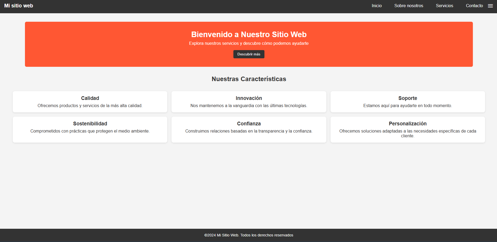
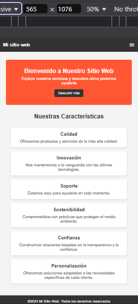

# 🌐 Css-UTN-MDS 🎨

Este proyecto es un Trabajo Práctico que consiste en la creación de una página web utilizando **HTML** y **CSS**. La página está diseñada para ser responsiva y adaptarse tanto a dispositivos móviles como a pantallas de escritorio.

## 📄 Descripción de la Página

La página incluye las siguientes secciones:

1. **Encabezado (Header)**:

   - Contiene el título del sitio web.
   - Una barra de navegación con enlaces a "Inicio", "Sobre Nosotros", "Servicios" y "Contacto".
   - Un ícono de menú para dispositivos móviles (usando Google Fonts: Material Symbols).

2. **Contenido Principal (Main)**:

   - **Banner**: Un mensaje de bienvenida con un botón de acción.
   - **Sección de Características**: Seis tarjetas que destacan las principales características del sitio.

3. **Pie de Página (Footer)**:
   - Incluye un texto con los derechos de autor.

## 🛠️ Tecnologías Utilizadas

- **HTML5**: Para la estructura de la página.
- **CSS3**: Para los estilos, utilizando:
  - Variables CSS para colores personalizados.
  - Flexbox y Grid para la disposición de elementos.
  - Media Queries para la responsividad.

## ✨ Características Principales

- **Diseño Responsivo**: Adaptable a dispositivos móviles y pantallas grandes.
- **Estilos Personalizados**:
  - Colores definidos mediante variables CSS.
  - Efectos hover en enlaces y botones.
  - Tarjetas con `box-shadow` y `border-radius`.
- **Iconos**: Uso de Google Fonts (Material Symbols) para el ícono de menú.

## 🖼️ Ejemplo Visual

### 💻 Vista en Escritorio

### 📱 Vista en Móvil

## 📋 Instrucciones de Uso

1. Clona este repositorio.
2. Abre el archivo `index.html` en tu navegador para visualizar la página.
3. Modifica los archivos según tus necesidades para personalizar el diseño.

## 👥 Créditos

Trabajo realizado como parte del curso de **CSS - UTN MDS**.
